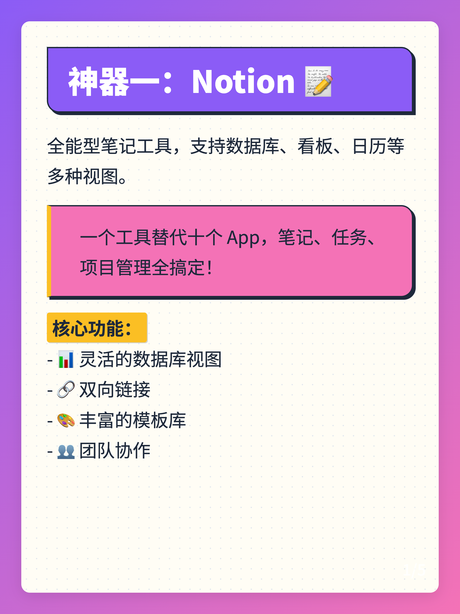
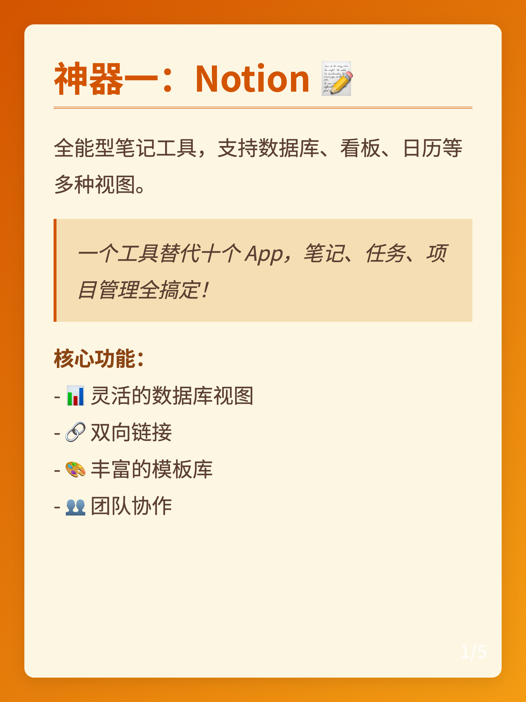
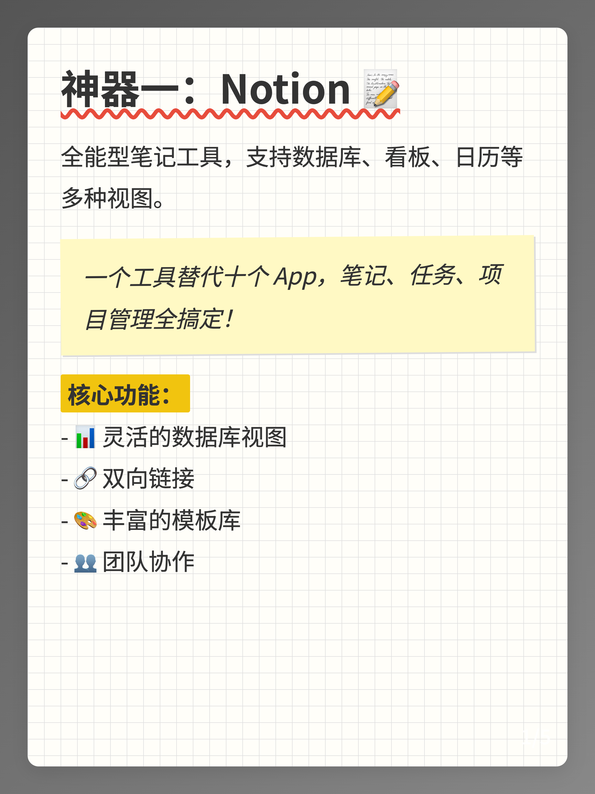
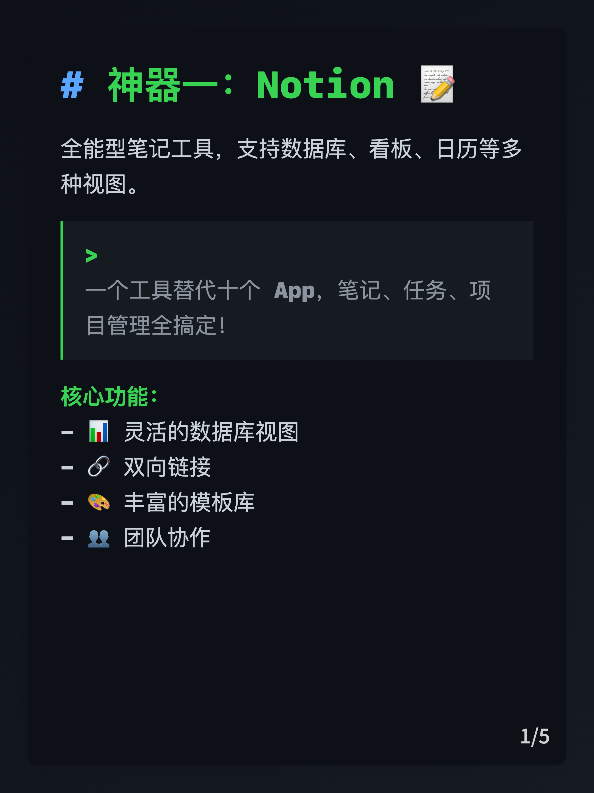
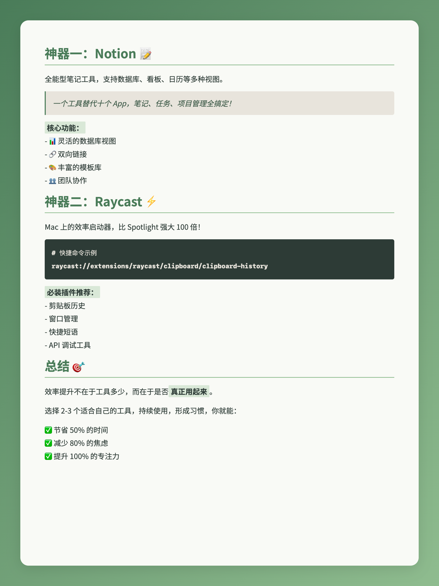

## 📕 Auto-Redbook-Skills（已重构版）

> 自动撰写小红书笔记、生成多主题卡片、可选自动发布的 Skills  
> 当前版本对渲染脚本和样式系统做了**一次完整重构**，感谢 Cursor 的辅助开发 🙌

---

## ✨ 本次重构亮点

- **🎨 8 套主题皮肤**：默认简约灰 + Playful Geometric / Neo-Brutalism / Botanical / Professional / Retro / Terminal / Sketch
- **📐 4 种分页模式**：
  - `separator`：按 `---` 分隔手动分页
  - `auto-fit`：固定尺寸，自动整体缩放内容，避免溢出/大面积留白
  - `auto-split`：根据渲染后高度自动拆分为多张卡片
  - `dynamic`：根据内容动态调整图片高度
- **🧱 统一卡片结构**：外层浅灰背景（`card-container`）+ 内层主题背景（`card-inner`）+ 纯排版层（`card-content`）
- **🧠 封面与正文一体化**：封面背景、标题渐变和正文卡片背景都按主题自动匹配

---

## 🖼 主题效果示例

> 所有示例均为 1080×1440px，小红书推荐 3:4 比例
> 更多示例去 [demo](/demos) 中查看  

|||
|---|---|
|||
|||

### Auto-fit 模式示例（自动缩放）



---

## 🚀 使用方式总览

### 1. 克隆项目

```bash
git clone https://github.com/comeonzhj/Auto-Redbook-Skills.git
cd Auto-Redbook-Skills
```

可以将本项目放到支持 Skills 的客户端目录，例如：

- Claude：`~/.claude/skills/`
- Alma：`~/.config/Alma/skills/`
- TRAE：`/your-path/.trae/skills/`

### 2. 安装依赖

**Python：**

```bash
pip install -r requirements.txt
playwright install chromium
```

**Node.js：**

```bash
npm install
npx playwright install chromium
```

---

## 🎨 渲染图片（Python）

核心脚本：`scripts/render_xhs.py`

```bash
# 最简单用法（默认主题 + 手动分页）
python scripts/render_xhs.py demos/content.md

# 使用自动分页（推荐：内容长短难控）
python scripts/render_xhs.py demos/content.md -m auto-split

# 使用固定尺寸自动缩放（auto-fit）
python scripts/render_xhs.py demos/content_auto_fit.md -m auto-fit

# 切换主题（例如 Playful Geometric）
python scripts/render_xhs.py demos/content.md -t playful-geometric -m auto-split

# 自定义尺寸和像素比
python scripts/render_xhs.py demos/content.md -t retro -m dynamic --width 1080 --height 1440 --max-height 2160 --dpr 2
```

**主要参数：**

| 参数 | 简写 | 说明 |
|------|------|------|
| `--theme` | `-t` | 主题：`default`、`playful-geometric`、`neo-brutalism`、`botanical`、`professional`、`retro`、`terminal`、`sketch` |
| `--mode` | `-m` | 分页模式：`separator` / `auto-fit` / `auto-split` / `dynamic` |
| `--width` | `-w` | 图片宽度（默认 1080） |
| `--height` |  | 图片高度（默认 1440，`dynamic` 为最小高度） |
| `--max-height` |  | `dynamic` 模式最大高度（默认 2160） |
| `--dpr` |  | 设备像素比，控制清晰度（默认 2） |

> 生成结果会包含：封面 `cover.png` + 正文卡片 `card_1.png`、`card_2.png`...

---

## 🎨 渲染图片（Node.js）

脚本：`scripts/render_xhs.js`，参数与 Python 基本一致：

```bash
# 默认主题 + 手动分页
node scripts/render_xhs.js demos/content.md

# 指定主题 + 自动分页
node scripts/render_xhs.js demos/content.md -t terminal -m auto-split
```

---

## 📤 发布到小红书

### 1. 配置 Cookie

```bash
cp env.example.txt .env
```

编辑 `.env`：

```env
XHS_COOKIE=your_cookie_string_here
```

> 获取方式：浏览器登录小红书 → F12 → Network → 任意请求的 Cookie 头，复制整串。

### 2. 手动发布（可选）

```bash
python scripts/publish_xhs.py \
  --title "笔记标题" \
  --desc "笔记描述内容" \
  --images cover.png card_1.png card_2.png
```

**可选参数：**

| 参数 | 说明 |
|------|------|
| `--private` | 设为私密笔记 |
| `--post-time "2024-01-01 12:00:00"` | 定时发布 |
| `--api-mode` | 通过 xhs-api 服务发布 |
| `--dry-run` | 仅验证，不实际发布 |

---

## 📁 项目结构（重构后）

```bash
Auto-Redbook-Skills/
├── SKILL.md              # 技能描述（Agent 使用说明）
├── README.md             # 项目文档（你现在看到的）
├── requirements.txt      # Python 依赖
├── package.json          # Node.js 依赖
├── env.example.txt       # Cookie 配置示例
├── assets/
│   ├── cover.html        # 封面 HTML 模板
│   ├── card.html         # 正文卡片 HTML 模板
│   ├── styles.css        # 共用容器样式（cover-inner / card-inner 等）
│   └── example.md        # 示例 Markdown
├── assets/themes/        # 主题样式（只控制排版 & 内层背景）
│   ├── default.css
│   ├── playful-geometric.css
│   ├── neo-brutalism.css
│   ├── botanical.css
│   ├── professional.css
│   ├── retro.css
│   ├── terminal.css
│   └── sketch.css
├── demos/                # 各主题示例渲染结果
│   ├── content.md
│   ├── content_auto_fit.md
│   ├── auto-fit/
│   ├── playful-geometric/
│   ├── retro/
│   ├── Sketch/
│   └── terminal/
└── scripts/
    ├── render_xhs.py     # Python 渲染脚本（支持主题 + 分页模式）
    ├── render_xhs.js     # Node.js 渲染脚本
    └── publish_xhs.py    # 小红书发布脚本
```

---

## ⚠️ 注意事项

1. **Cookie 安全**：不要把 `.env` 提交到 Git 或共享出去。
2. **Cookie 有效期**：过期后发布失败是正常现象，重新抓一次 Cookie 即可。
3. **发布频率**：避免短时间内高频发布，以免触发平台风控。
4. **图片尺寸**：默认 1080×1440px，符合小红书推荐比例。

---

## 🙏 致谢

- [Playwright](https://playwright.dev/) - 浏览器自动化渲染
- [Marked](https://marked.js.org/) - Markdown 解析
- [xhs](https://github.com/ReaJason/xhs) - 小红书 API 客户端
- **Cursor** - 本次重构过程中提供了极大帮助 ❤️

---

## 📄 License

MIT License © 2026
